# Carrinho Wi‑Fi ESP32 PET v1

[← Voltar ao início](../README.md)

Neste projeto, diferentes [subsistemas](08a-integracao-mecanica-eletrica-carrinho.md#sistema-e-subsistemas) trabalham juntos: o ESP32 cria sua própria rede Wi‑Fi e uma página de controle para movimentar dois motores DC por meio da ponte H MX1508. A montagem possui dois [domínios de alimentação](08a-integracao-mecanica-eletrica-carrinho.md#domínios-de-alimentação) e duas chaves: uma para o ESP32 e outra para os motores.

## Conceitos

- [Tensão, corrente e potência](01b-grandezas-eletricas.md)
- [Pilhas em série](01c-circuitos-alimentacao.md#pilhas-em-série)
- [Pilhas em paralelo](01c-circuitos-alimentacao.md#pilhas-em-paralelo)
- [GND comum entre ESP32 e ponte H](01c-circuitos-alimentacao.md#gnd-comum-entre-esp32-e-ponte-h)
- [VCC e polaridade](01c-circuitos-alimentacao.md#vcc-5-v-e-33-v)
- [Soldagem, curto-circuito e montagem segura](01d-montagem-seguranca.md)
- [Arduino IDE, pacote de placa, compilação e upload](02b-ide-usb-drivers.md)
- [GPIO, HIGH e LOW](02c-gpio-digital.md)
- [Interruptores](04a1-botoes-interruptores.md#interruptor)
- [Motor DC, corrente de partida e ponte H](05c-motores-servo.md)
- [LM2596, step-down, trimpot e multímetro](05d-lcd-lm2596.md#lm2596)
- [ESP32, alimentação, Wi‑Fi e níveis lógicos](07a-esp32.md)
- [Impressão 3D FDM, fatiamento e montagem](07b-impressora-3d-fdm.md)
- [Integração mecânica, elétrica, testes e diagnóstico](08a-integracao-mecanica-eletrica-carrinho.md)

Essas fundamentações explicam as escolhas do projeto: as [pilhas são ligadas em série](01c-circuitos-alimentacao.md#pilhas-em-série) para somar tensão; a ponte H fornece corrente e inverte o sentido dos motores; o [GND comum](01c-circuitos-alimentacao.md#gnd-comum-entre-esp32-e-ponte-h) dá referência aos sinais; o LM2596 reduz a tensão; e as GPIO apenas comandam o driver, sem alimentar motores.

## Componentes

:::component-grid
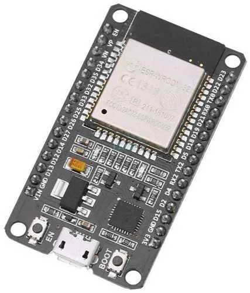
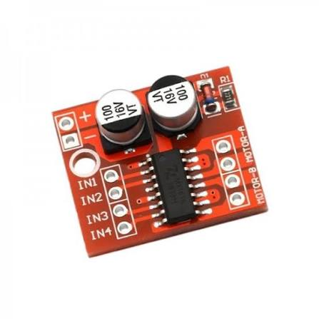
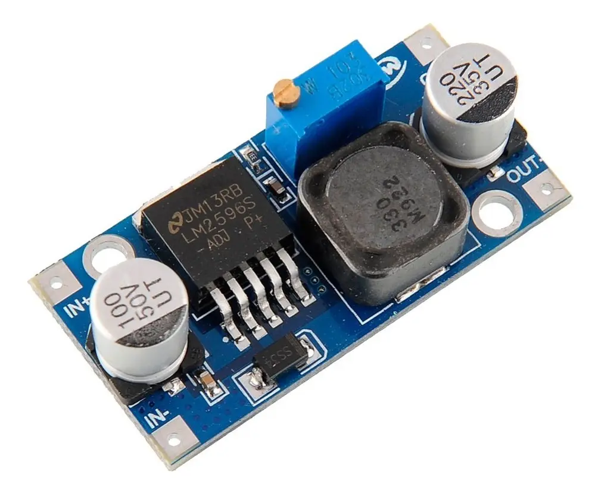
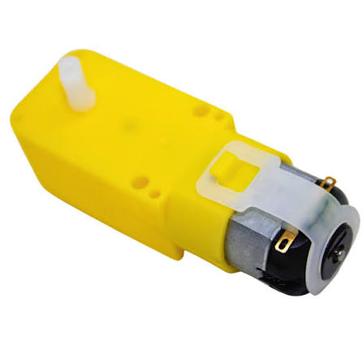
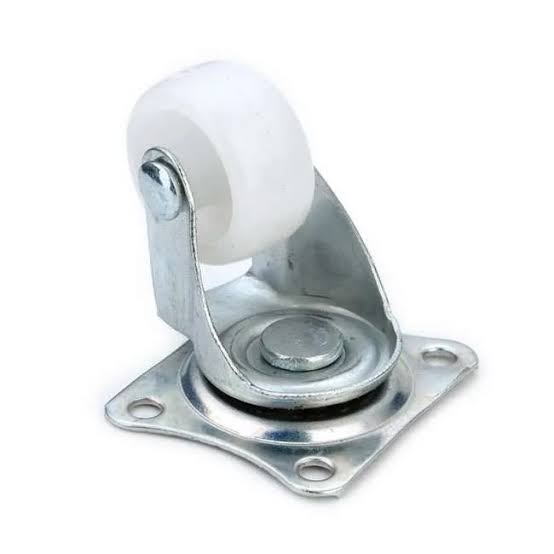
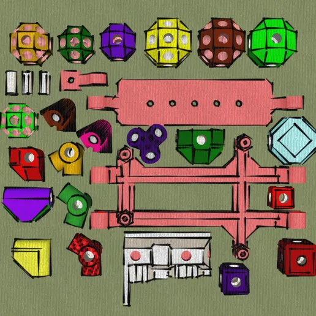
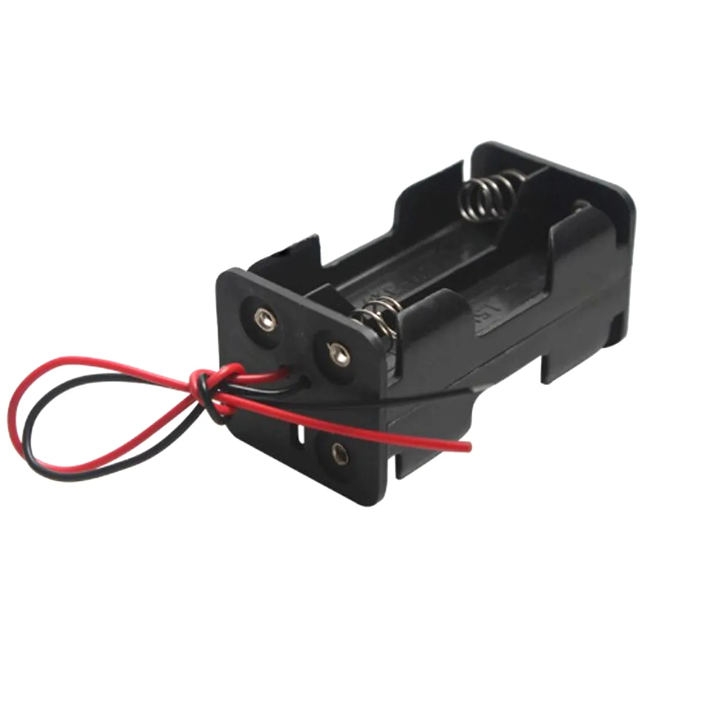
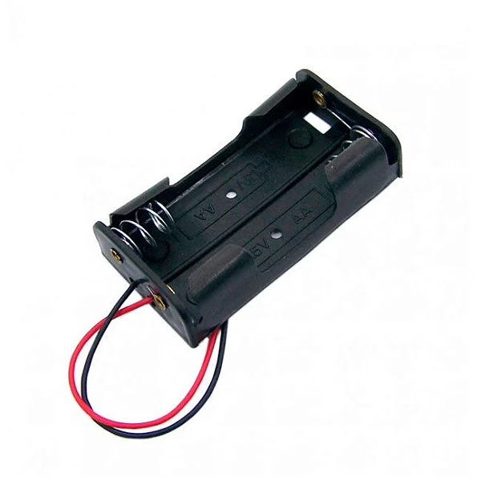


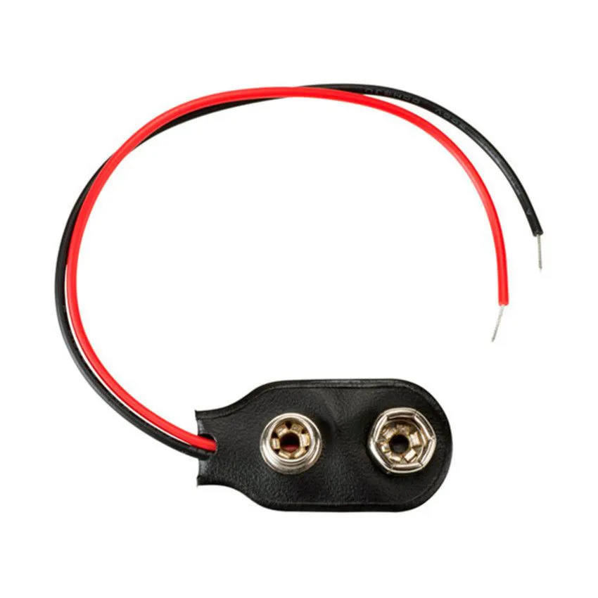
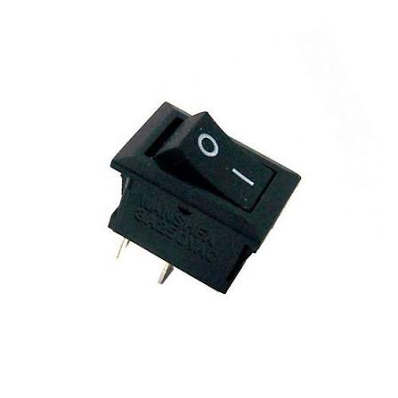
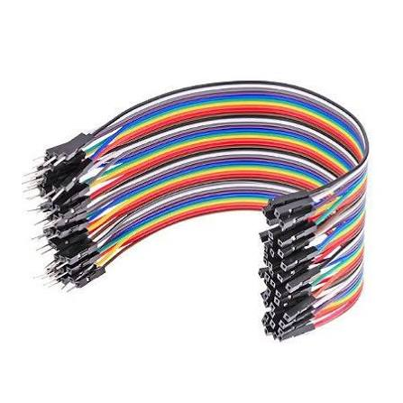

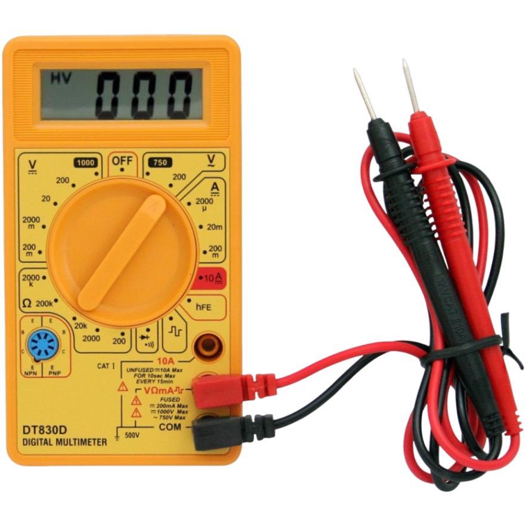
:::end-component-grid

## Chassi ModuBot

O chassi será montado com o modelo 3D [ModuBot, disponível no Cults3D](https://cults3d.com/pt/modelo-3d/diversos/modubot). Considere `1× conjunto impresso do chassi ModuBot` na lista de materiais do projeto.

### Montagem mecânica

1. Separe os [**vértices e arestas**](08a-integracao-mecanica-eletrica-carrinho.md#vértices-arestas-e-faces): os vértices são as peças impressas em 3D e as arestas são os palitinhos. Entre os vértices, identifique as peças específicas para os motores TT, a roda boba e o ESP32.
2. Planeje o formato do carrinho e introduza as arestas nos pontos de encaixe dos vértices. Os palitinhos formam as arestas da [estrutura modular](08a-integracao-mecanica-eletrica-carrinho.md#protótipo-modular) e mantêm as peças impressas conectadas.
3. Confira o esquadro da estrutura e confirme que os dois lados possuem comprimentos equivalentes antes do aperto final.
4. Recorte as [**faces**](08a-integracao-mecanica-eletrica-carrinho.md#vértices-arestas-e-faces) em papel-cartão ou papelão, usando a estrutura como referência. Fixe as faces sem deformar as arestas e preserve aberturas para fios, chaves, bateria e [manutenção](08a-integracao-mecanica-eletrica-carrinho.md#manutenibilidade).
5. Parafuse cada motor TT em seu vértice específico, parafuse a roda boba em seu vértice específico e parafuse o ESP32 no vértice destinado à placa.
6. Conecte esses vértices específicos à estrutura usando as arestas, ou seja, os palitinhos. Verifique a [rigidez](08a-integracao-mecanica-eletrica-carrinho.md#rigidez-estrutural), o [alinhamento](08a-integracao-mecanica-eletrica-carrinho.md#alinhamento), o giro livre das rodas e a estabilidade da [roda boba](08a-integracao-mecanica-eletrica-carrinho.md#roda-boba).
7. Posicione temporariamente a MX1508, o LM2596, os suportes de pilhas e as duas chaves. Distribua os itens pesados considerando o [centro de massa](08a-integracao-mecanica-eletrica-carrinho.md#centro-de-massa), planeje os fios e mantenha o USB do ESP32, o trimpot, os bornes e as chaves acessíveis.
8. Mantenha a região da antena do ESP32 livre de metal, pilhas e feixes de fios.

## Guia de montagem

> **Regra de segurança:** mantenha as duas chaves desligadas ao soldar, encaixar ou alterar qualquer fio. Siga um [teste por etapas](08a-integracao-mecanica-eletrica-carrinho.md#teste-por-etapas): teste antes de conectar o ESP32, depois de soldar os jumpers e novamente antes da primeira partida.

### Fluxo geral

1. Monte a estrutura ModuBot conectando os vértices impressos em 3D por meio das arestas, que são os palitinhos, e adicione as faces de papel-cartão ou papelão. Parafuse os motores TT, a roda boba e o ESP32 aos respectivos vértices específicos e conecte-os ao restante da estrutura por meio das arestas.
2. Escolha uma estratégia para a eletrônica: montar e soldar o circuito fora do chassi para depois fazer a [fixação com cola quente](08a-integracao-mecanica-eletrica-carrinho.md#fixação-e-cola-quente); ou posicionar e colar cada componente no chassi antes de fazer a soldagem.
3. Em qualquer estratégia, trabalhe sem alimentação. A cola quente não deve cobrir bornes, conectores, o trimpot do LM2596, botões, a porta USB ou a antena do ESP32. Aguarde a cola esfriar e aplique [alívio de tensão](08a-integracao-mecanica-eletrica-carrinho.md#alívio-de-tensão) nos fios antes de aproximar pilhas ou ligar o circuito.
4. Solde e conecte os componentes conforme as etapas seguintes.
5. **Antes de encaixar os jumpers do LM2596 em `VIN/5V` e `GND` do ESP32, meça obrigatoriamente a saída e confirme aproximadamente `5,0 V`. Depois de qualquer nova solda nessa alimentação, meça novamente.**
6. Encaixe a alimentação somente depois de confirmar `5,0 V`, ligue a chave do ESP32 e observe os LEDs do LM2596 e da placa. Em seguida, desligue a chave novamente.
7. Desenvolva o código ou obtenha um modelo de controle, conecte o ESP32 ao computador por USB e faça o upload com as duas chaves do carrinho desligadas.

### 1. Alimentação de 5 V do ESP32

1. Confirme com o multímetro qual fio do conector da bateria de 9 V é positivo e qual é negativo.
2. Solde o fio positivo do conector em um terminal da primeira chave gangorra.
3. Solde outro fio do segundo terminal da chave até `IN+` do LM2596.
4. Ligue o negativo do conector diretamente a `IN−` do LM2596.
5. Isole as soldas. Não conecte a saída ao ESP32 ainda.

O caminho é **positivo da bateria → chave → `IN+` do LM2596**. A chave precisa interromper o positivo; nenhum outro fio pode contorná-la.

### 2. Ajuste obrigatório do LM2596

1. Conecte a ponta preta do multímetro em `COM` e a vermelha em `V/Ω`.
2. Selecione tensão contínua, indicada por `V⎓`, `VDC` ou uma linha contínua sobre uma tracejada. Em um multímetro manual como o DT830D, use a escala **20 V DC**.
3. Ligue somente a chave da bateria de 9 V.
4. Encoste a ponta preta em `OUT−` e a vermelha em `OUT+`. Não permita que as pontas se toquem.
5. Gire lentamente o trimpot até o visor indicar aproximadamente **5,0 V**. Alguns módulos precisam de muitas voltas.
6. Desligue a chave e desconecte a bateria.

> **Teste obrigatório:** o ESP32 permanece desconectado durante o ajuste. Nunca use a escala de corrente `A` para medir tensão, pois isso pode provocar curto-circuito. Não confie na posição do trimpot: confirme o valor no multímetro.

### 3. Jumpers do LM2596 e alimentação do ESP32

1. Corte jumpers com extremidade fêmea e solde-os em `OUT+` e `OUT−` do LM2596.
2. Isole separadamente as duas soldas.
3. Reconecte a bateria, ligue a chave e **meça novamente nas extremidades dos jumpers**.
4. Confirme polaridade e aproximadamente `5,0 V`.
5. Desligue a chave. Encaixe `OUT+` no pino `VIN/5V` e `OUT−` em um pino `GND` do ESP32.

Não solde diretamente no ESP32. Os `5 V` alimentam a entrada `VIN/5V` da placa; as GPIO do chip continuam usando lógica de `3,3 V`. **Medir novamente depois da soldagem dos jumpers é obrigatório.**

> **Não encaixe `VIN/5V` e `GND` por confiança visual. Meça nos jumpers, confirme a polaridade e confirme aproximadamente `5,0 V` imediatamente antes de conectá-los ao ESP32.**

### 4. Teste dos LEDs de alimentação

1. Depois de medir e confirmar aproximadamente `5,0 V`, encaixe `OUT+` do LM2596 em `VIN/5V` e `OUT−` em `GND` do ESP32.
2. Ligue a chave da bateria de 9 V e observe se o LED do LM2596 e o LED de alimentação do ESP32 acendem.
3. Se algum LED não acender, desligue imediatamente e confira bateria, chave, soldas, polaridade e continuidade.
4. Mesmo que os dois LEDs acendam, isso **não comprova** que a tensão está correta. O valor de aproximadamente `5,0 V` precisa ter sido confirmado com o multímetro antes da conexão.
5. Desligue a chave novamente antes de continuar a montagem, conectar GPIO, soldar motores ou enviar o código.

### 5. Pilhas em série e chave dos motores

Esta etapa usa o conceito de [pilhas em série](01c-circuitos-alimentacao.md#pilhas-em-série): as tensões dos dois suportes se somam.

1. Separe seis pilhas AA do mesmo tipo, química, capacidade e estado de carga.
2. Inspecione as pilhas. Não use unidades amassadas, enferrujadas, aquecidas, inchadas ou com vazamento.
3. Coloque quatro pilhas AA no suporte **2×2** e duas pilhas AA no suporte `1×2`, respeitando os símbolos `+` e `−` gravados nos suportes.
4. Confira visualmente cada pilha antes de continuar. Uma pilha invertida pode reduzir a tensão do conjunto, aquecer ou vazar.
5. Una o negativo de um suporte ao positivo do outro para formar a [ligação em série](01c-circuitos-alimentacao.md#pilhas-em-série).
6. No positivo que sobrou, instale a segunda chave: positivo das pilhas → chave → `VCC` da MX1508.
7. Ligue o negativo que sobrou diretamente ao `GND` da MX1508.
8. Com a chave desligada, confira continuidade, polaridade e ausência de curto.
9. Ligue a chave sem os motores, meça a tensão entre `VCC` e `GND` e desligue novamente.

Se as seis pilhas forem alcalinas de `1,5 V`, o conjunto fornece aproximadamente `9 V`. Se forem NiMH recarregáveis de `1,2 V`, fornece aproximadamente `7,2 V`. Não misture químicas, capacidades, pilhas novas e usadas. Veja também o efeito e os cuidados de uma [ligação de pilhas em paralelo](01c-circuitos-alimentacao.md#pilhas-em-paralelo).

### 6. Cuidados com as pilhas AA

- **Antes da montagem:** com as pilhas fora dos suportes, meça cada uma em `V⎓`, escala `20 V DC`. Encoste a ponta preta no polo `−` e a vermelha no polo `+`. Compare as seis leituras e substitua unidades muito diferentes das demais.
- **Alcalinas:** são pilhas descartáveis de aproximadamente `1,5 V`; nunca tente recarregá-las.
- **NiMH:** são recarregáveis de aproximadamente `1,2 V`; carregue-as somente em carregador próprio para NiMH e, de preferência, como um conjunto mantido junto.
- **Durante o uso:** pare imediatamente se houver aquecimento anormal, cheiro, ruído ou vazamento. Desligue as duas chaves e não toque diretamente em material vazado.
- **Após o uso:** desligue as duas chaves. Retire as pilhas dos suportes se o carrinho ficar guardado por vários dias, evitando vazamento e corrosão dos contatos.
- **Transporte:** mantenha as pilhas organizadas, sem contato com moedas, parafusos, ferramentas ou outros metais que possam unir os polos.
- **Descarte:** não jogue pilhas no fogo nem no lixo comum. Isole os terminais e leve pilhas usadas ou danificadas a um ponto de coleta apropriado.

### 7. GND comum e sinais da ponte H

Com as duas chaves desligadas, ligue um `GND` do ESP32 ao `GND` da MX1508. O [GND comum](01c-circuitos-alimentacao.md#gnd-comum-entre-esp32-e-ponte-h) é a referência dos sinais de controle; ele não substitui os negativos das duas fontes. Antes dessa etapa, a alimentação do ESP32 já deve ter sido medida e confirmada em aproximadamente `5,0 V`.

Solde jumpers com extremidade fêmea nos pontos de controle da MX1508 e encaixe-os no ESP32. Não solde no ESP32.

| ESP32 | MX1508 | Função |
|---|---|---|
| `D27` | `IN1` | Controle 1 do motor A |
| `D26` | `IN2` | Controle 2 do motor A |
| `D32` | `IN3` | Controle 1 do motor B |
| `D18` | `IN4` | Controle 2 do motor B |

Depois da soldagem, faça um [teste de continuidade](08a-integracao-mecanica-eletrica-carrinho.md#continuidade-elétrica) fio a fio e confirme que não existe curto entre pinos vizinhos. **Teste novamente antes de energizar.**

### 8. Motores

Na ponte H deste projeto, as duas saídas estão identificadas como **Motor A** e **Motor B**. Cada saída possui dois bornes sem identificação individual. Para orientar a montagem, eles serão chamados apenas de **primeiro terminal** e **segundo terminal** de cada saída; essa nomenclatura não representa positivo e negativo fixos.

Os dois motores formam uma [tração diferencial](08a-integracao-mecanica-eletrica-carrinho.md#tração-diferencial): o movimento depende da combinação dos sentidos do lado A e do lado B.

1. Solde os dois fios de um motor no primeiro e no segundo terminal da saída **Motor A**.
2. Solde os dois fios do outro motor no primeiro e no segundo terminal da saída **Motor B**.
3. Isole as soldas e prenda os fios para a vibração não forçar os terminais.
4. A ordem correta dos dois fios será descoberta no teste prático. Suspenda o carrinho, execute um comando de movimento e observe o sentido de cada motor.
5. Se um motor girar no sentido contrário ao necessário, desligue as duas chaves e troque entre si os dois fios desse motor. Nunca faça essa inversão com o circuito energizado.

## Imagem do circuito

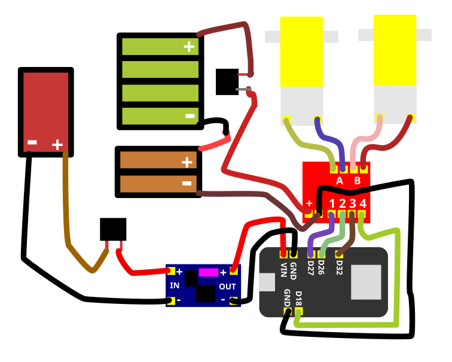

## Código

:::featured-link
**Gerador de código e controles para carrinhos com ESP32**

Nesta página é possível obter códigos, modelos de controle e diferentes esquemas de programação que podem ser carregados no ESP32 para controlar carrinhos. Use o gerador para explorar outras formas de comando e adaptar o comportamento do projeto.

[Abrir o gerador de código e modelos de controle →](https://gabrieljsantos.github.io/gerador_codigo/index.html)
:::end-featured-link

O programa transforma o ESP32 em um [ponto de acesso SoftAP](07a-esp32.md#softap-e-ponto-de-acesso) chamado `Carrinho-ESP32`. Depois de conectar o celular a essa [rede Wi‑Fi local](07a-esp32.md#rede-wi-fi-local), a página de controle é aberta pelo [endereço IP local](07a-esp32.md#endereço-ip-local) `192.168.4.1`. O ESP32 atua como [servidor](07a-esp32.md#cliente-e-servidor), e os comandos usam [rotas HTTP](07a-esp32.md#rotas-http) para acionar os quatro pinos da ponte H. A função `parar()` estabelece um [estado seguro](07a-esp32.md#estado-seguro) antes de iniciar o Wi‑Fi. O sentido físico correspondente a `Frente` será confirmado na prática, pois depende da ordem dos fios nos dois terminais de Motor A e Motor B.

```cpp
#include <WiFi.h>
#include <WebServer.h>

const char* nomeRede = "Carrinho-ESP32";
const char* senhaRede = "carrinho123";

const int IN1 = 27;
const int IN2 = 26;
const int IN3 = 32;
const int IN4 = 18;

// Troque false por true se um dos motores girar invertido.
const bool inverterMotorA = false;
const bool inverterMotorB = false;

WebServer servidor(80);

void motores(bool a1, bool a2, bool b1, bool b2) {
  if (inverterMotorA) {
    bool temporario = a1;
    a1 = a2;
    a2 = temporario;
  }
  if (inverterMotorB) {
    bool temporario = b1;
    b1 = b2;
    b2 = temporario;
  }
  digitalWrite(IN1, a1); digitalWrite(IN2, a2);
  digitalWrite(IN3, b1); digitalWrite(IN4, b2);
}

void parar()    { motores(LOW, LOW, LOW, LOW); }
void frente()   { motores(HIGH, LOW, HIGH, LOW); }
void tras()     { motores(LOW, HIGH, LOW, HIGH); }
void esquerda() { motores(LOW, HIGH, HIGH, LOW); }
void direita()  { motores(HIGH, LOW, LOW, HIGH); }

const char pagina[] PROGMEM = R"HTML(
<!doctype html><html lang="pt-BR"><head>
<meta name="viewport" content="width=device-width,initial-scale=1">
<title>Carrinho ESP32</title><style>
body{font-family:sans-serif;text-align:center;margin:30px;background:#eef2f5}
.controle{display:grid;grid-template-columns:repeat(3,90px);gap:12px;justify-content:center}
button{min-height:70px;font-size:18px;border:0;border-radius:12px;background:#2457a7;color:white}
.parar{background:#b32424}</style></head><body><h1>Carrinho ESP32</h1>
<div class="controle"><span></span><button onclick="cmd('frente')">Frente</button><span></span>
<button onclick="cmd('esquerda')">Esquerda</button><button class="parar" onclick="cmd('parar')">Parar</button>
<button onclick="cmd('direita')">Direita</button><span></span><button onclick="cmd('tras')">Ré</button><span></span></div>
<script>function cmd(c){fetch('/'+c)}</script></body></html>
)HTML";

void responderCom(void (*movimento)()) {
  movimento();
  servidor.send(200, "text/plain", "ok");
}

void setup() {
  Serial.begin(115200);
  pinMode(IN1, OUTPUT); pinMode(IN2, OUTPUT);
  pinMode(IN3, OUTPUT); pinMode(IN4, OUTPUT);
  parar();

  WiFi.mode(WIFI_AP);
  WiFi.softAP(nomeRede, senhaRede);

  servidor.on("/", []() { servidor.send_P(200, "text/html; charset=utf-8", pagina); });
  servidor.on("/frente", []() { responderCom(frente); });
  servidor.on("/tras", []() { responderCom(tras); });
  servidor.on("/esquerda", []() { responderCom(esquerda); });
  servidor.on("/direita", []() { responderCom(direita); });
  servidor.on("/parar", []() { responderCom(parar); });
  servidor.begin();

  Serial.print("Conecte-se a "); Serial.println(nomeRede);
  Serial.print("Abra http://"); Serial.println(WiFi.softAPIP());
}

void loop() {
  servidor.handleClient();
}
```

Se `Frente` fizer o carrinho girar ou recuar, identifique qual motor está invertido. No código, altere `inverterMotorA` ou `inverterMotorB` de `false` para `true`, faça novo upload e repita o teste. A alternativa física é desligar as duas chaves e trocar entre si os dois fios daquele motor.

## Enviar o código ao ESP32

O código do carrinho deve ser enviado ao ESP32 usando a **Arduino IDE**. Com as duas chaves do carrinho desligadas, conecte o ESP32 ao computador por um cabo USB de dados, abra o código, selecione a placa e a porta corretas e clique em **Carregar**.

:::featured-link
**Eu não sei fazer**

Use a documentação de apoio para preparar o computador e a placa:

- [O que é a Arduino IDE](02b-ide-usb-drivers.md#arduino-ide)
- [Como instalar a Arduino IDE](02b-ide-usb-drivers.md#como-instalar-a-arduino-ide)
- [Como configurar e escolher a placa ESP32-WROOM](02b-ide-usb-drivers.md#como-configurar-a-placa-esp32-wroom)
- [Drivers USB do ESP32](02b-ide-usb-drivers.md#drivers-usb-do-esp32)
- [Como encontrar a porta no Windows](02b-ide-usb-drivers.md#como-encontrar-a-porta-no-windows)

[Abrir o guia completo de Arduino IDE e ESP32 →](02b-ide-usb-drivers.md)
:::end-featured-link

Depois de configurar a Arduino IDE, crie um sketch, cole o código do projeto, clique em **Verificar** e depois em **Carregar**. Aguarde a confirmação do upload antes de retirar o cabo USB.

## Usar o controle Wi‑Fi

O ESP32 cria uma [rede Wi‑Fi local](07a-esp32.md#rede-wi-fi-local) para controlar o carrinho. Essa rede **não fornece acesso à internet**. O [SSID e a senha](07a-esp32.md#ssid-e-senha) são definidos no começo do código pelas variáveis `nomeRede` e `senhaRede`; portanto, podem ser alterados antes do upload. Se você mudar esses valores, use no celular o novo nome e a nova senha, e não os exemplos abaixo.

1. Desconecte o USB antes de usar a alimentação do carrinho.
2. Faça a revisão elétrica e ligue primeiro a chave do ESP32.
3. No celular, conecte-se a `Carrinho-ESP32` com a senha `carrinho123`.
4. Permaneça conectado quando o celular avisar que essa rede não possui internet.
5. Abra `http://192.168.4.1` no navegador.
6. Se a página não abrir ou o celular abandonar a rede do ESP32, desligue temporariamente os dados móveis e recursos como troca automática para uma rede com internet. Reconecte-se ao Wi‑Fi do carrinho e tente o endereço novamente.
7. Suspenda o carrinho para as rodas não tocarem o chão e ligue a chave dos motores.
8. Teste `Parar`, `Frente`, `Ré`, `Esquerda` e `Direita`.

O modo [SoftAP](07a-esp32.md#softap-e-ponto-de-acesso) faz o ESP32 criar uma rede própria e servir a [interface HTML, CSS e JavaScript](07a-esp32.md#interface-html-css-e-javascript) localmente, sem roteador. O celular conversa diretamente com o ESP32; essa conexão controla o carrinho, mas não oferece internet.

## Checklist antes da primeira partida

Este checklist faz parte do [comissionamento](08a-integracao-mecanica-eletrica-carrinho.md#comissionamento) do carrinho: cada verificação deve ser concluída antes do teste seguinte.

- LM2596 medido em `V⎓`, escala `20 V DC`, e ajustado para aproximadamente `5,0 V`.
- Tensão medida novamente depois da soldagem dos jumpers.
- `OUT+` do LM2596 ligado a `VIN/5V`, nunca a uma GPIO ou ao pino `3V3`.
- Suporte `4×AA` no formato `2×2` ligado em [série](01c-circuitos-alimentacao.md#pilhas-em-série) ao suporte `2×AA` no formato `1×2`.
- Seis pilhas AA iguais, saudáveis, com polaridade conferida e leituras individuais compatíveis.
- Uma chave no positivo da bateria de 9 V e outra no positivo das pilhas AA.
- D27/IN1, D26/IN2, D32/IN3 e D18/IN4 conferidos.
- [GND do ESP32 e GND da MX1508 interligados](01c-circuitos-alimentacao.md#gnd-comum-entre-esp32-e-ponte-h).
- Um motor ligado aos dois terminais de **Motor A** e o outro aos dois terminais de **Motor B**, nunca diretamente ao ESP32.
- Soldas isoladas, continuidade testada e nenhum curto entre terminais.
- Upload concluído com a placa e a porta corretas.

Para o carrinho funcionar, **as duas chaves precisam estar ligadas**. Uma alimenta o ESP32 pelo LM2596; a outra alimenta a MX1508 e os motores.

## Diagnóstico rápido

Faça uma alteração por vez e use o método de [isolamento de falhas](08a-integracao-mecanica-eletrica-carrinho.md#isolamento-de-falhas) para descobrir em qual subsistema o comportamento se altera.

- **Rede Wi‑Fi não aparece:** confira os `5 V` em `VIN/5V`, a chave do ESP32, o upload e o nome definido em `nomeRede`.
- **Página não abre:** confirme que o celular continua conectado à rede do ESP32 e digite `http://192.168.4.1` completo. Se necessário, desligue temporariamente os dados móveis e a troca automática de rede. O Wi‑Fi criado pelo ESP32 é local e não possui internet.
- **GND da ponte H e do ESP32 desconectados:** os dois módulos perdem a referência comum dos sinais. Os motores podem ignorar comandos, funcionar de maneira intermitente ou responder de forma imprevisível. Desligue as duas chaves, restaure a ligação entre os GND e consulte o conceito de [GND comum entre ESP32 e ponte H](01c-circuitos-alimentacao.md#gnd-comum-entre-esp32-e-ponte-h).
- **Bateria de 9 V descarregada e LED azul do LM2596 apagado:** desligue o circuito e meça a bateria na escala `20 V DC`. Confira também o conector, a chave e a tensão em `IN+`/`IN−` do LM2596. Substitua a bateria descarregada e, antes de reconectar o ESP32, ajuste e confirme novamente aproximadamente `5,0 V` na saída.
- **ESP32 reiniciando:** isso pode ser um [brownout](07a-esp32.md#brownout). Meça a saída do LM2596 durante a inicialização do Wi‑Fi. Reinicializações podem indicar [queda de tensão](08a-integracao-mecanica-eletrica-carrinho.md#queda-de-tensão), bateria fraca, mau contato, solda ruim ou fonte incapaz de fornecer os [picos de corrente](08a-integracao-mecanica-eletrica-carrinho.md#pico-de-corrente). Confirme `5,0 V` sob carga e use uma fonte com capacidade adequada.
- **Motores não giram:** confirme a segunda chave, a tensão em `VCC/GND` da MX1508, a continuidade e se existe travamento mecânico. Uma roda presa pode levar o motor à [corrente de travamento](08a-integracao-mecanica-eletrica-carrinho.md#corrente-de-travamento).
- **Motor invertido:** altere `inverterMotorA` ou `inverterMotorB` de `false` para `true`, envie novamente o código e repita o teste com o carrinho suspenso. Como alternativa, desligue as duas chaves e troque entre si os dois fios do motor invertido.
- **Comandos trocados:** confira D27/IN1, D26/IN2, D32/IN3 e D18/IN4.
- **Falta de corrente para o ESP32:** uma ligação de baterias em paralelo mantém a tensão e pode aumentar a capacidade de corrente, mas não deve ser improvisada. Não una diretamente duas baterias de 9 V diferentes ou com cargas diferentes. Prefira uma bateria nova capaz de fornecer a corrente necessária, uma fonte adequada ou um suporte projetado para células iguais e protegido. Consulte [pilhas em paralelo](01c-circuitos-alimentacao.md#pilhas-em-paralelo) e [pilhas em série](01c-circuitos-alimentacao.md#pilhas-em-série) antes de alterar a alimentação.

[← Voltar ao início](../README.md)
